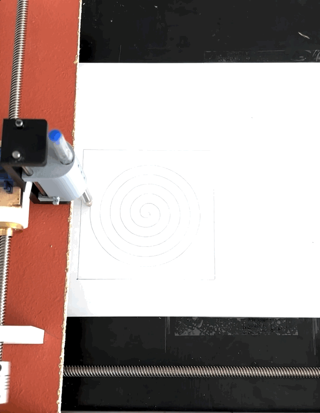
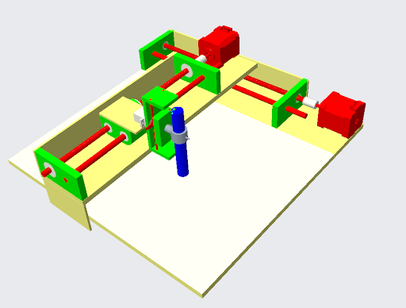
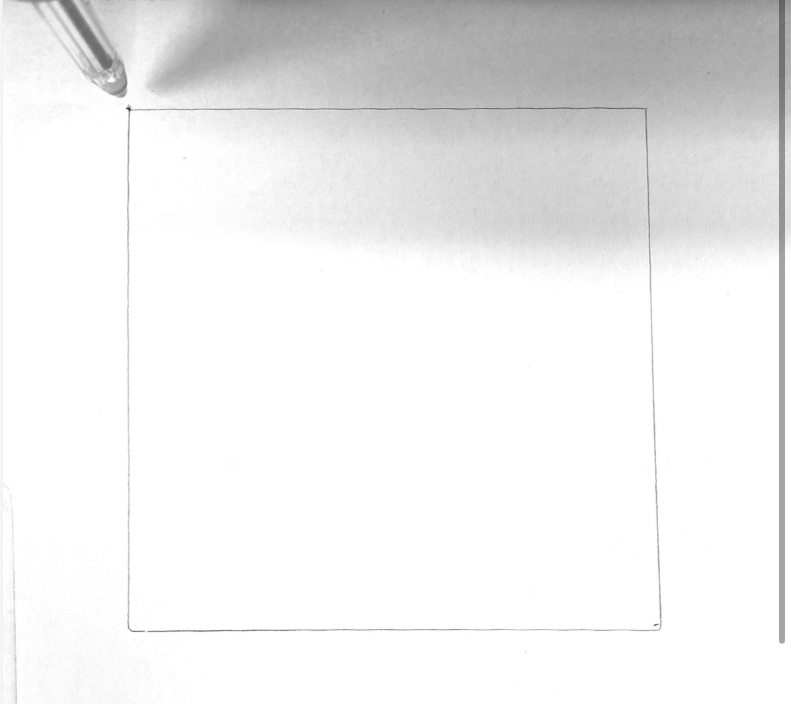
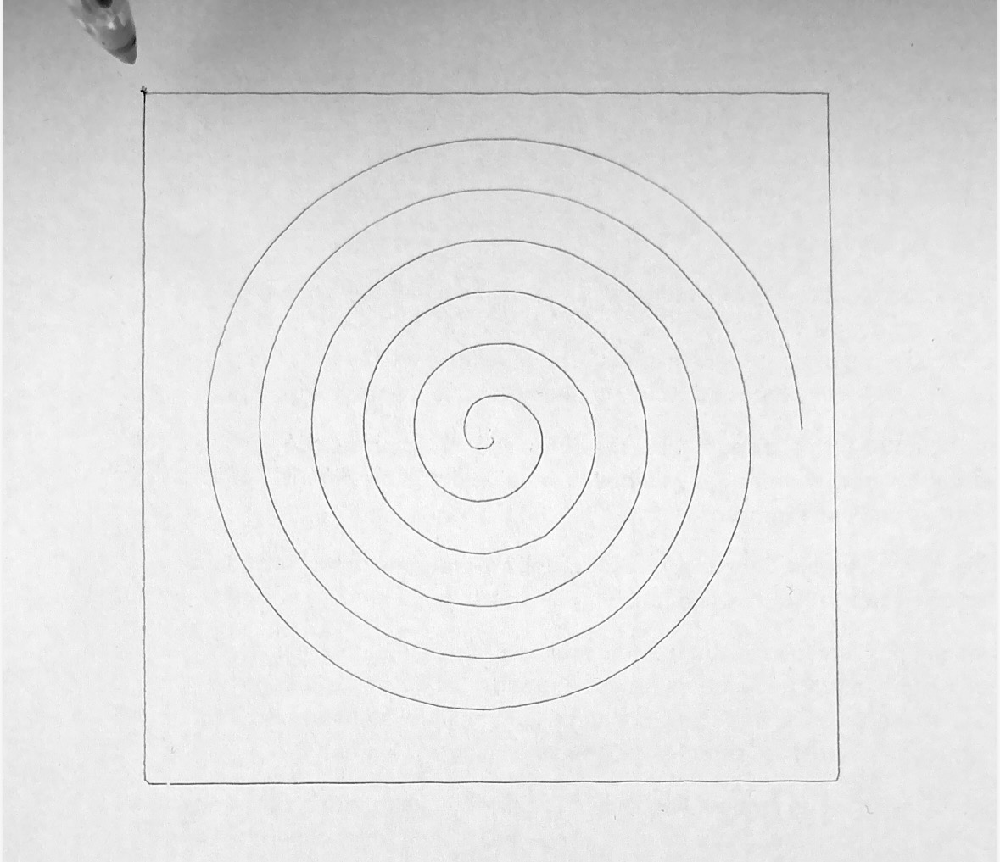
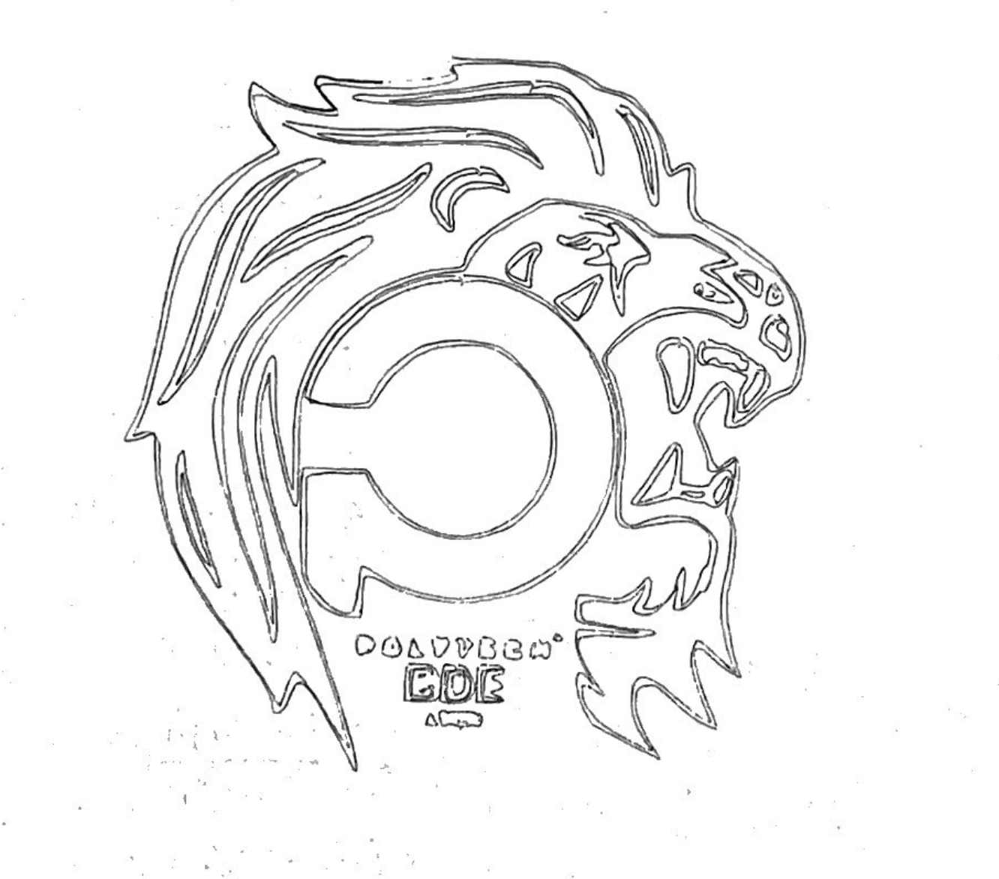

# 2D Pen Plotter — Mechatronics Engineering Project

> A fully self-built 2-axis pen plotter: mechanical design in CAD, 3D-printed and wood-machined
> frame, lead-screw kinematics, and an end-to-end software chain from vector drawing to physical
> output — from a blank page to a working drawing machine.

<!--
  INSTRUCTIONS (delete before pushing to GitHub):
  - Replace every [TODO] with your real content.
  - Add demo.gif as the very first image: film the machine drawing, convert at ezgif.com/video-to-gif (free, 30 s).
    Drag the file into GitHub's file picker → copy the URL → replace the placeholder below.
  - Add your YouTube unlisted link in the Demo section.
  - Photos needed: top view, close-up of pen carriage, a finished drawing on paper.
  - Delete this comment block before pushing.
-->



---

## Overview

| | |
|---|---|
| **Type** | Academic group project — 3rd year engineering (Polytech Lyon, Roanne) |
| **Speciality** | Systèmes Industriels et Robotique (SIR) |
| **Duration** | 8 months — September 2025 to June 2026 (~90 h/student) |
| **Team** | Malo Rocher · Lilian Philip · Ousmane Sanghare · Jules Tafforeau |
| **Supervisor** | Clément Hignette, Polytech Lyon |
| **Stack** | Creo Parametric · FDM 3D printing · Arduino Uno · GRBL · Inkscape · UGS |
| **Budget** | ~195 € (target: 100 €) |
| **Status** | Complete — complex drawings validated |

The plotter reproduces any vector drawing on A4 paper with **±0.3 mm positioning accuracy**.
Every mechanical part was designed from scratch in CAD and 3D-printed or cut from wood.
The electronics stack runs GRBL firmware on an Arduino Uno with A4988 stepper drivers.

---

## System Architecture

```
[Inkscape]  ──SVG──▶  [G-code generator]  ──USB──▶  [UGS]  ──Serial──▶  [Arduino Uno + GRBL]
  (design)              (Inkscape plugin)             (sender)              (firmware)
                                                                                │
                                                    ┌───────────────────────────┤
                                                    │                           │
                                               [A4988 × 2]               [A4988 × 1]
                                          NEMA 17 stepper motors      Servo MG90-180
                                            X-axis    Y-axis              Z-axis
                                          (lead screw) (lead screw)    (pen up/down)
```

**Step 1 — Inkscape (SVG design)**
Vector drawing made in Inkscape (free, open-source). Saved as `.svg`.

**Step 2 — G-code generation**
An Inkscape plugin converts the SVG vectors to G-code automatically.
`G1 X46.2 Y94.1` = move linearly to that point. `G2/G3` = clockwise/counter-clockwise arc.
`M3/M5` = pen down / pen up.

**Step 3 — UGS (Universal G-Code Sender)**
Desktop app that reads the G-code file and streams it line-by-line to the Arduino over USB.

**Step 4 — GRBL firmware on Arduino Uno**
GRBL is an open-source CNC firmware. It receives G-code commands and translates them into
step/direction pulses for the stepper drivers. We configured it for our mechanics (steps/mm,
acceleration, max feed rate).

**Step 5 — A4988 drivers + mechanics**
A4988 chips drive the NEMA 17 stepper motors. Configured at **1/16 microstepping → 3 200 steps/rev**
for smooth, silent motion.

---

## Mechanical Design

**Architecture:** Gantry (portique) — X and Y Cartesian axes, Z axis for pen lift.

| Sub-system | Solution chosen | Why |
|---|---|---|
| X/Y motion | NEMA 17 stepper + Tr8×8 lead screw | Precision prioritised over cost (FP1 = 43% of functional weight) |
| Linear guidance | Ø8 mm steel shafts + LM8UU ball bearings | Rigid, low-friction, replaces belts |
| Z axis (pen) | Servo MG90-180 | Simple up/down, no positioning needed |
| Chassis | Wood (MDF-type) | Rigid, low environmental impact |
| Interface parts | FDM PLA, 273 g total | Custom-fit between standard components |

**3D-printed parts (Creo Parametric → STL → PLA):**
- Motor + shaft end supports (Y and X axes)
- 4× bearing housings (Ø22/8/7 mm press-fit)
- Y-axis stabiliser
- Sliding carriage (glissière support)
- X/Y axis reinforcement brackets
- Servo-motor bracket
- Pen holder + pen clamp

**Key design lesson:** CAD tolerances ≠ physical tolerances. PLA shrinks ~0.3–0.5% post-print.
Every housing was iterated 2–3 times to achieve the right press-fit on the Ø8 mm shafts.

| CAD model | Physical build |
|---|---|
|  |  |
<!-- [TODO] Add your photos to docs/ -->

---

## Bill of Materials (BOM)

| Part | Qty | Unit price | Supplier |
|---|---|---|---|
| Precision steel shaft Ø8 mm × 400 mm | 2 | 13.63 € | RS Components |
| Lead screw Tr8×8 P2 × 35 mm | 2 | 11.99 € | Robotshop |
| 5 mm → 8 mm shaft coupler | 2 | 6.29 € | Robotshop |
| Linear rail (glissière) LM8UU | 4 | 8.71 € | Robotshop |
| Lead screw nut (écrou mobile 2668) | 2 | 5.60 € | Gotronic |
| Servo MG90-180 | 1 | 4.85 € | Gotronic |
| Stepper NEMA 17 (17HS15-0404S) | 2 | 19.90 € | Gotronic |
| Ball bearing 22/8/7 mm | 4 | 1.10 € | Gotronic |
| Arduino Uno Shield (Robo Uno) | 1 | 17.70 € | Gotronic |
| CNC Shield ARD-CNC-K1 + A4988 | 1 | 18.80 € | Gotronic |
| **Total** | | **195.38 €** | |

---

## Validation Results

Three test drawings, timed and visually validated against the original SVG:

| Test | Duration | What it validates |
|---|---|---|
| Reference square | ~45 s | X/Y axis orthogonality |
| Archimedean spiral | ~2 min | Simultaneous X+Y coordination |
| Polytech Lyon logo (complex) | ~10 min | Full precision on a detailed vector |

**Key problem solved:** the machine vibrated and made noise at certain speeds.
Root cause: microstepping jumpers not enabled on the A4988 shields.
Fix: enabling 1/16 microstepping → 3 200 steps/rev → smooth, silent motion.
All qualitative specifications **fully validated** ✅.

Results:

| Square | Spiral | Logo |
|---|---|---|
|  |  |  |
<!-- [TODO] Add your test photos to docs/ -->

---

## What I Learned

- **Theory vs. physical reality:** a CAD fit that works on screen requires 2–3 print iterations to
  account for PLA shrinkage and shaft tolerances.
- **Debugging a mechatronic system:** the firmware was correct, the machine still vibrated —
  the issue was hardware (jumper configuration), not software.
- **Engineering tradeoffs:** we exceeded budget by ~95 € to achieve the required precision.
  Lead screws and ball bearings cost more than belts and bushings but delivered the ±0.3 mm spec.
- **Project management over 8 months:** WBS, GANTT, PERT, RACI — learned how a structured
  decomposition makes a group project actually deliverable.
- **End-to-end ownership:** from functional analysis (diagramme pieuvre, Suh matrix) through
  CAD, 3D printing, wiring, firmware configuration, and validation testing.

---
## Repository Structure

```
plotter-2d/
├── docs/                  # Photos, GIF, test results
│   ├── demo.gif
│   ├── cad-model.png
│   ├── machine-photo.jpg
│   ├── test-square.jpg
│   ├── test-spiral.jpg
│   └── test-logo.jpg
├── cad/                   # Creo .prt / .asm + exported STL files
│   ├── bearing-housing.stl
│   ├── motor-support-x.stl
│   ├── motor-support-y.stl
│   ├── pen-holder.stl
│   └── ...
├── grbl-config/           # GRBL $ parameters used (steps/mm, accel, etc.)
│   └── grbl-settings.txt
└── README.md
```

---

## Author

**Malo Rocher** — 1st-year engineering cycle (3A SIR), Polytech Lyon — Campus de Roanne
[malo.rocher@etu.univ-lyon1.fr](mailto:malo.rocher@etu.univ-lyon1.fr) · [LinkedIn](https://www.linkedin.com/in/malo-rocher-044b553b7/)
